# セットアップ
[ailia DX Insight 1.0から1.1へのアップデートがまだの方はこちらをご確認ください。](v1_1update.md) 

[ailia DX Insight 1.2のアップデート内容はこちらをご確認ください](v1_2update.md)

## ダウンロード
ailia DX Insightを<a href="https://ailia.ai/dx/" target="_blank">ダウンロード</a>して、zipを解凍します。
## インストーラの起動
Windowsの場合は、aillia_dx_insight.msixをダブルクリックしてインストーラを起動します。 macOSの場合は、ailia_dx_insight.dmgを右クリックして開くで起動します。 
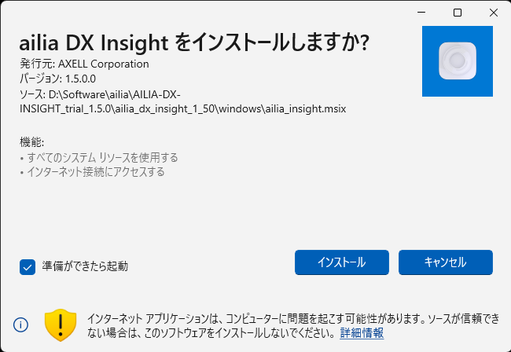 
## ライセンスもしくはコンフィグファイルの選択
初回起動時に「ライセンスもしくはコンフィグファイルを選択してください」とウィンドウに表示されます。ライセンスファイルをフォルダから選択します。 

起動に必要なライセンスファイルはmacOSの場合は[HOME]/Library/SHALO、windowsの場合は[ROOT]/ProgramData/SHALOに格納されます。 
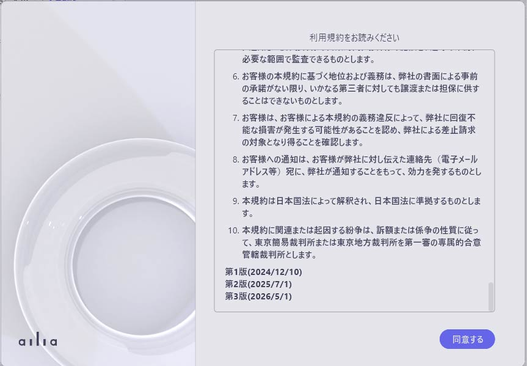 
[コンフィグファイルを選択する](ConfigFile.md)ことでアプリケーションをカスタマイズすることができます。

## OpenAIのAPIキーの取得
OpenAIのWEBページでアカウント登録を行い、[OpenAIのAPIキーを取得します。](OpenAI_APIKey.md) OpenAIのAPIキーを入力しなくてもailia DX Insightは使用できますが、機能が制限されます。
## セットアップ
ライセンスもしくはコンフィグファイルを選択後、チュートリアル画面が表示されます。 
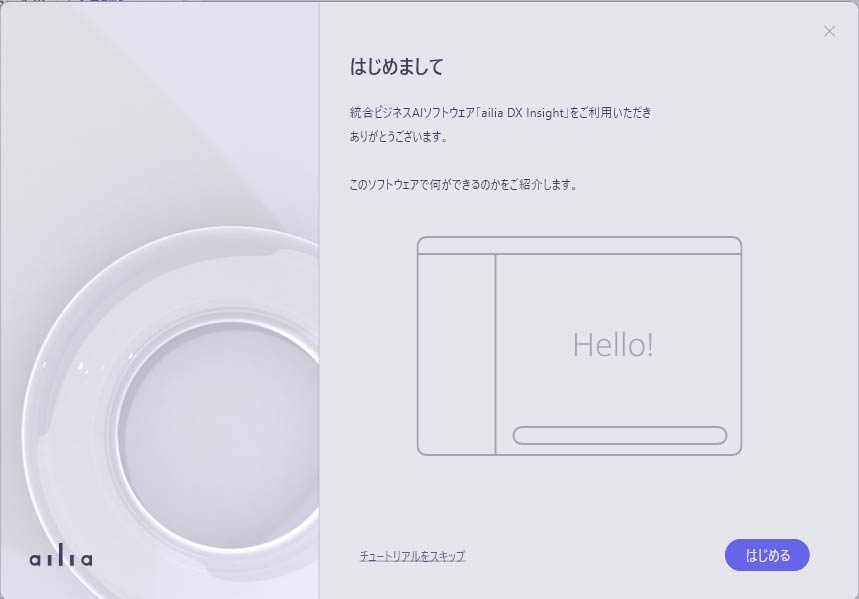 
チュートリアルの最終画面にて、OpenAI APIキーの設定が可能です。
### OpenAI APIキーの設定
#### チュートリアルから設定する場合
1. チュートリアルの最後、「APIキーの設定」まで進みます。
1. 「OpenAI APIキー」の下にあるテキストボックスに、"sk-"から始まるOpenAI APIキーを入力します。 
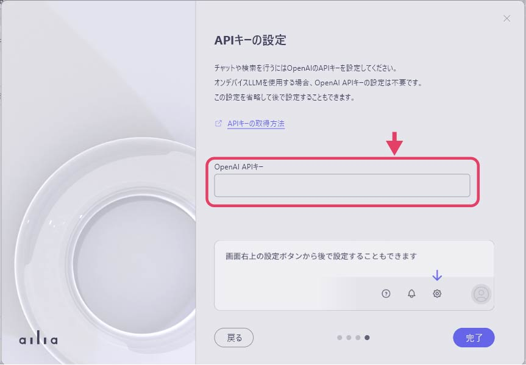 
1. 「完了」ボタンを押します。

#### 通常画面から設定する場合
1. 画面右上にある歯車アイコンを押します。 
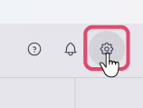 
1. 「チャットAI」の項目内にある、「APIキー」から、「今すぐ設定する」を選択します。 
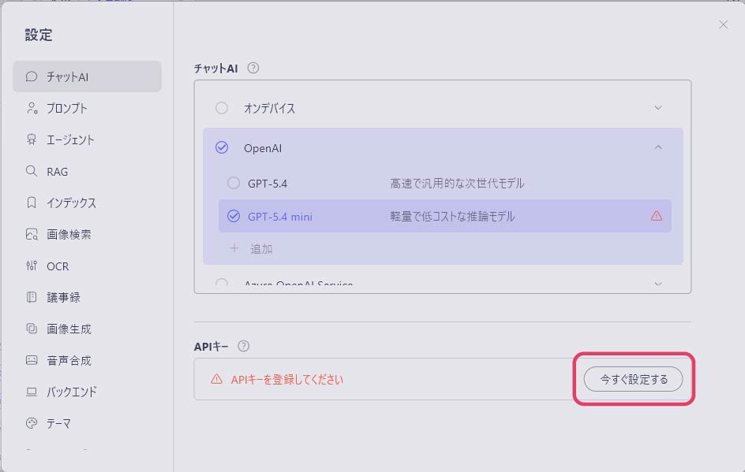 
1. 表示されたダイアログ内のテキストボックスに、"sk-"から始まるOpenAIのAPIキーを入力します。 
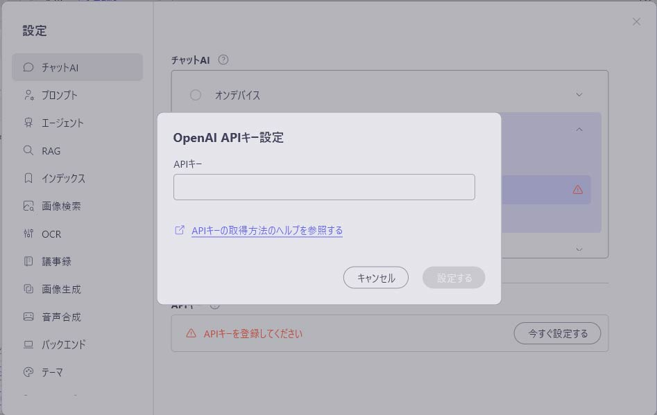 
1. 「OpenAI」をクリックして、使用するchatGPTのバージョンを選択し、「閉じる」ボタンを押します。
### AIモデルのダウンロード
初回起動時のチュートリアルの終了後、AIモデルのダウンロードが開始されます。
ダウンロードの進捗は左のサイドバー下部にて確認できます。 
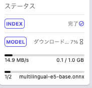 
ダウンロード完了後、ailia DX Insightが使用可能となります。

## OpenAIモデルの選択
1. ailia DX insightの画面にて、右上の歯車アイコンをクリックして設定ウィンドウを表示させます。 
 
1. 「チャットAI」の項目の中にある「OpenAI」をクリックし、モデルを選択します。 
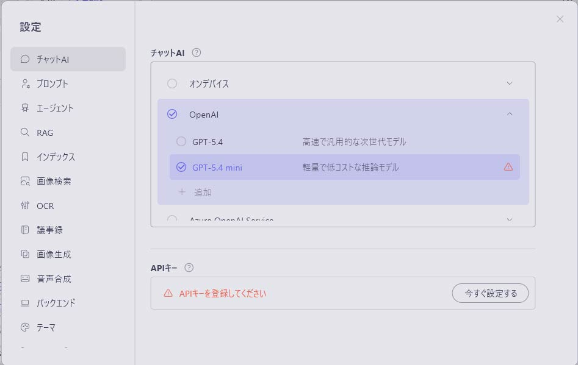 

 
※OpenAIがAPIでアクセスできるようにしているモデルであれば、モデル一覧の中になくとも追加することができます。 
OpenAIのモデル一覧の一番下にある「+追加」を選択し、モデル名/最大トークン長/説明(任意)を入力し、「完了」を押してモデルを追加してください。 

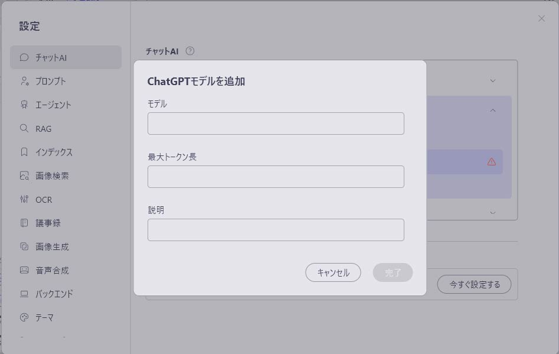

## カラーテーマの変更
ailia DX Insightの設定の中にある「テーマ」からカラーテーマを「ライト」「ダーク」で切り替えることができます。 
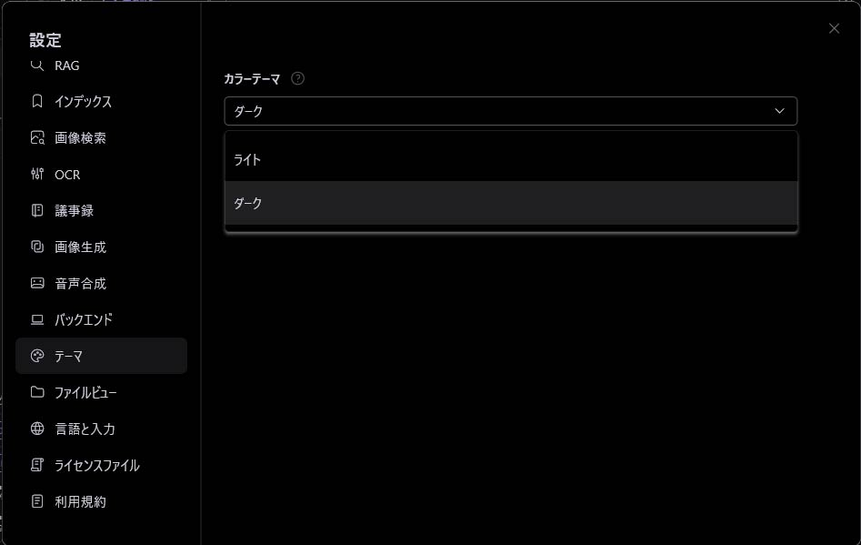 

※カラーテーマをダークにしている場合は、AIで生成された回答を範囲選択後、右クリックを押下すると、コンテキストメニューが白く表示されてしまいます。 
カラーテーマをダークにしている場合にAI回答欄をコピーしたい場合は回答欄の右側にある「コピー」を押下してください。 
（コードをコピーする場合はコードの欄にあるコピーのアイコンを押下してください） 
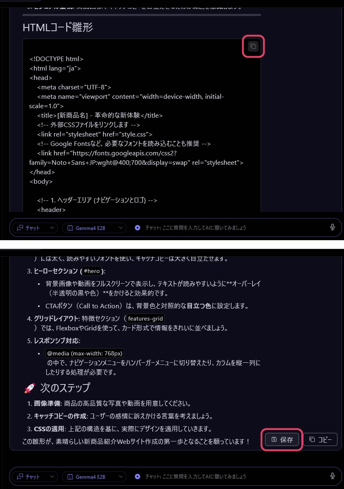 

 

#### [次のページへ&emsp;＞](v1_4update.md)